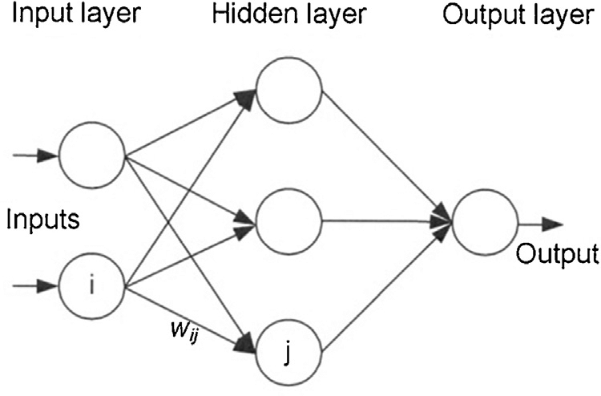

# Lecture 1
In lecture 1 we've learned, that a perceptron can be used as linear classifier.


We used a single perceptron to predict whether it's a good day to go swimming or not - based on an input vector with the binary inputs temperature, sunshine and friends.

Below are the weights and bias (as definded in the lecture) for this classification problem. Further, you will find a function "perceptron()" which takes an input_vector, weight_vector and a bias as inputs and outputs the prediction.

## Task 1
Try changing inputs, weights and bias of the perceptron to find how those changes affect the prediction.

## Task 2
Imagine you're building a computer out of binary logic gates (https://en.wikipedia.org/wiki/Logic_gate) and you want to use perceptrons as the smallest building blocks to build it.

Change the perceptrons inputs, weights and bias to implement the logic gates "AND", "NAND", "OR" and "NOR"

# Task 3
Now try to implement the logic gates "XAND" and "XOR" by changing the perceptrons parameters. Do you encounter any difficulties doing that? If yes, why is that?

# Task 4
Take a different approach implementing the logic gates "XAND" and "XOR" by combining logic gates you modeled in Task 2. (=> Implementing a Multilayer-Perceptron [MLP]).




```python
# imports

import pandas as pd
import numpy as np
```


```python
# parameters, weights and bias used in the lecture example

inputs = pd.Series([0, 1, 0], index=['Temp', 'Sun', 'Friends'])
weights = pd.Series([3, 2, 1], index=['Temp_w', 'Sun_w', 'Friends_w'])
bias = -2


# functions


def step(step_input):
    '''simple step function
    f(<=0) -> output = 0,
    f(>0) -> ouput = 1'''

    output = 0

    if step_input > 0:
        output = 1
    return output


# alternative to custom implementation of step function:
# np.heaviside(input, 0) # https://numpy.org/doc/stable/reference/generated/numpy.heaviside.html


def perceptron(inputs, weights, bias):
    '''compute perceptron output for given inputs, weights, and bias'''
    result = np.matmul(inputs.to_numpy(), weights.to_numpy()) + bias
    return step(result)

```


```python
# output
perceptron_output = perceptron(inputs, weights, bias) #get perceptrons output
print(perceptron_output)
```

    0


```python

```
