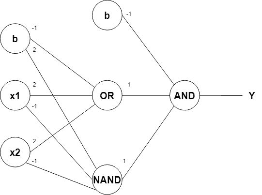

# Lecture 2

### Lecture Example:

- Setup the formula for the output of the given XOR multilayer perceptron using matrix operations
- Implement the derived formula in a python function




### Solution:


```python
%matplotlib widget
import matplotlib.pyplot as plt
plt.rcParams['figure.figsize'] = [12, 6]

import numpy as np
import pandas as pd
```


```python
def step(x):
    return np.heaviside(x, 0)


def xor(inputs):
    # define weights
    w_ih = np.array([[2, 2, -1], [-1, -1, 2]])  # weight matrix between input and hidden layer
    w_ho = np.array([1, 1, -1]).reshape(1, -1)  # weight vector between hidden layer and output, reshaped to get a 1x3 row vector

    # hidden layer output
    output_h = step(np.matmul(w_ih, inputs))
    output_h_extended = np.vstack((output_h, 1))  # extend layer output vector with an additional 1 for subsequent matrix multiplication

    # net output
    output = step(np.matmul(w_ho, output_h_edited))

    return output

```


```python
x_0 = 1
x_1 = 0
inputs = np.array([x_0, x_1, 1]).reshape(-1, 1) #reshape to get a 3x1 column vector

xor_output = xor(inputs)
print('XOR result: ', xor_output)
```

    XOR result:  [[1.]]

